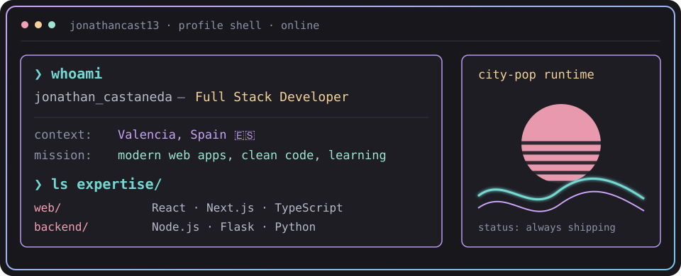

<!-- CITY-POP BANNER -->
<a href="https://github.com/jonathancast13">
  <picture>
    <source media="(prefers-color-scheme: dark)" srcset="assets/banner-dark.v9.svg">
    <source media="(prefers-color-scheme: light)" srcset="assets/banner-light.v9.svg">
    
  </picture>
</a>

 

---

## `$ whoami`

  

 

## `$ cat tech-stack.yaml`

<table border="1" cellpadding="14" bgcolor="#17171c">
  <thead>
    <tr>
      <th colspan="2" align="left"><code>jonathancast13:~$ cat tech-stack.yaml</code></th>
    </tr>
  </thead>
  <tbody>
    <tr>
      <td width="50%" valign="top"><code>├─ ✦ frontend:</code>  
        
        
        
        
        
        
        
      </td>
      <td width="50%" valign="top"><code>├─ ▣ backend_&amp;_databases:</code>  
        
        
        
        
        
        
      </td>
    </tr>
    <tr>
      <td valign="top"><code>├─ ⚙ tools_&amp;_versioning:</code>  
        
        
        
      </td>
      <td valign="top"><code>╰─ ⚁ exploring:</code>  
        
        
      </td>
    </tr>
  </tbody>
  <tfoot>
    <tr>
      <td colspan="2"><code>status: full_stack&nbsp;&nbsp;·&nbsp;&nbsp;environment: shipping</code></td>
    </tr>
  </tfoot>
</table>

---

## `$ cat skills-radar.log`

  <picture>
    <source media="(prefers-color-scheme: dark)" srcset="assets/radar-dark.svg">
    <source media="(prefers-color-scheme: light)" srcset="assets/radar-light.svg">
    
  </picture>

<code>signals: data_skill_radar · self_rated · status: healthy</code>

---

## `$ ls projects/ --featured`

 🏎️ **[F1 App](https://github.com/jonathancast13/f1_app_jonathanc)** - Web application focused on Formula 1 data and tracking, built using modern web development practices and clean architecture.

---

## `$ git log --stats`

---

<!-- SOCIALS -->
## `$ connect --contact`

&nbsp;&nbsp;
&nbsp;&nbsp;

 
 

 Valencia, Spain · @jonathancast13

